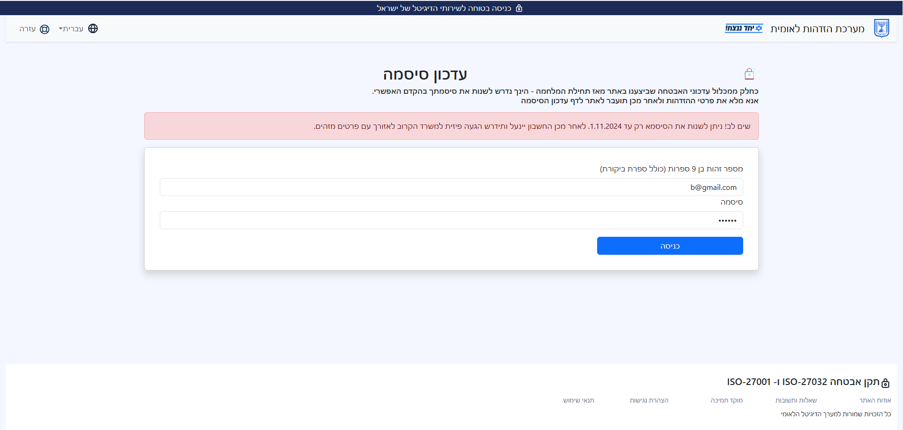
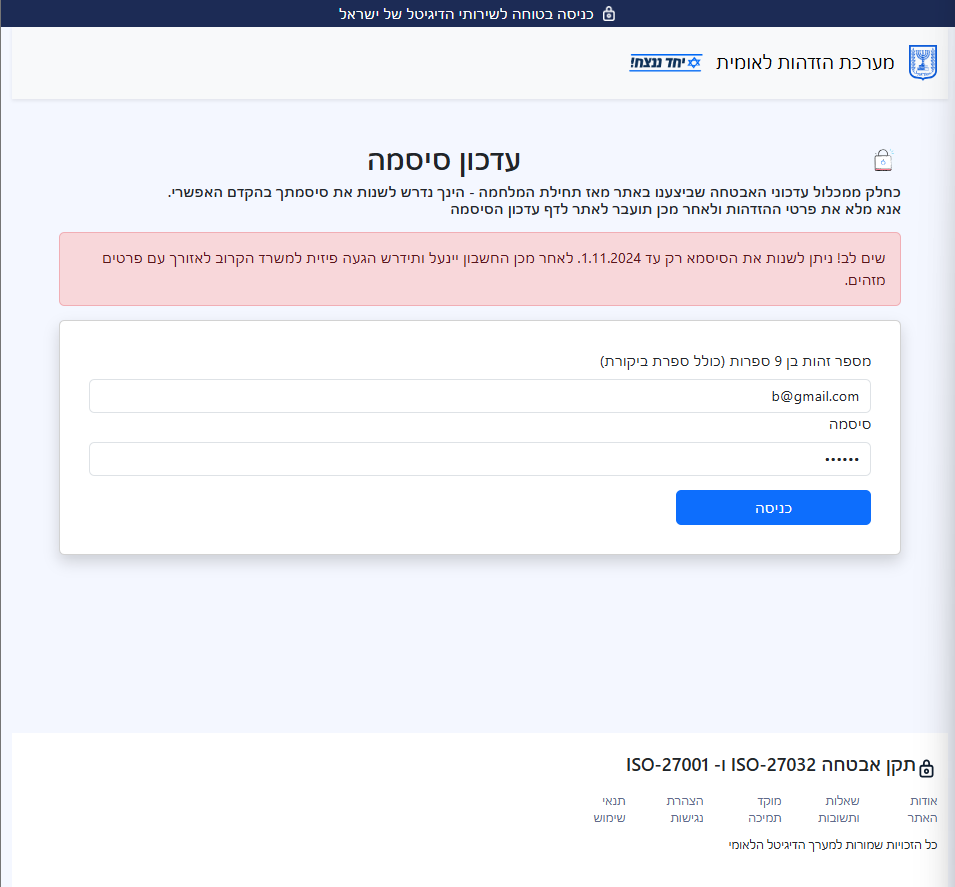
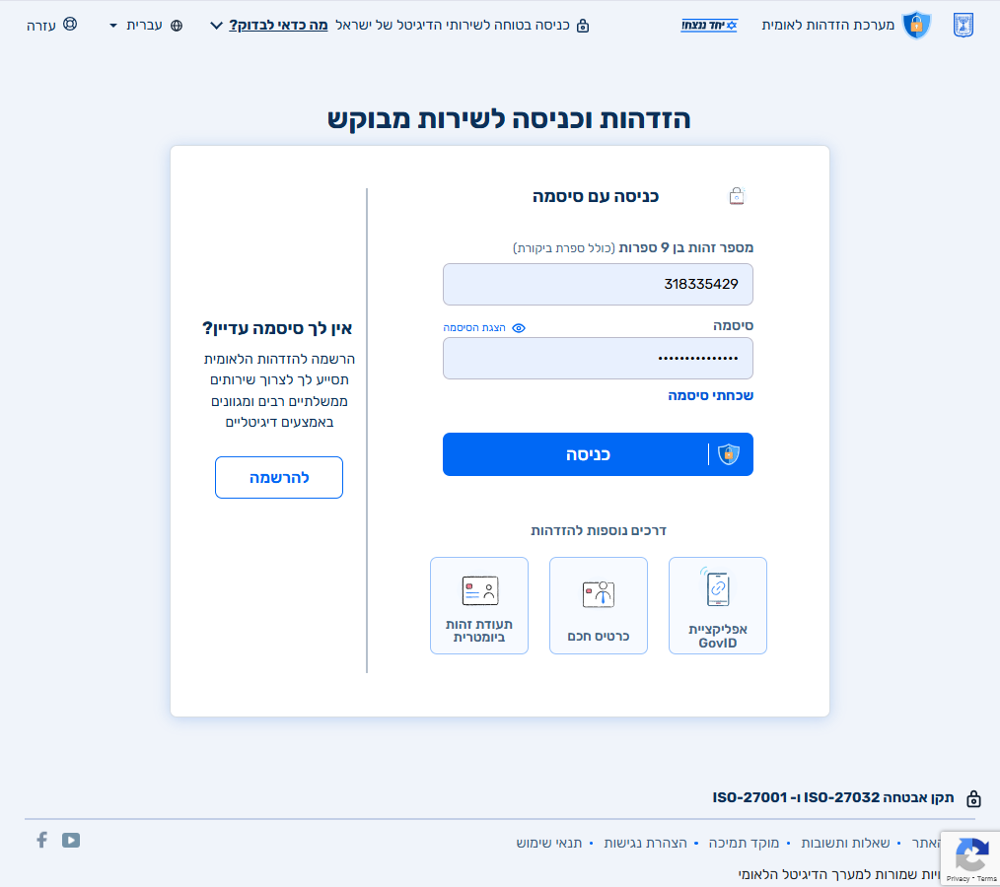

# Phishing site example
This example demonstrates how easy it is to build a phishing site. 
I used the `national identification system` of Israel for the demo. 
In the site -the user must change his/her password due to the condition in Israel, and immediately - as the alert emphasized. 

Site URL hosted in Vercel: https://phishing-demo-lake.vercel.app/

#### This is the site I created using React.js. 

#### Things to notice here for users:
1. Links lead to nowhere
2. Mistakes in design, especially when resizing the window.  
3. No 2 factors-Authentication. (espacially when it is a government site)
4. Weird IP(also - not Israeli ending - co.il)
5. Urgent Language(you must.. if not - the account will get locked)
6. The page is flat. There is no depth to it. 
7. No real SSL certificate. 

#### This is the real site I took some reference from:

